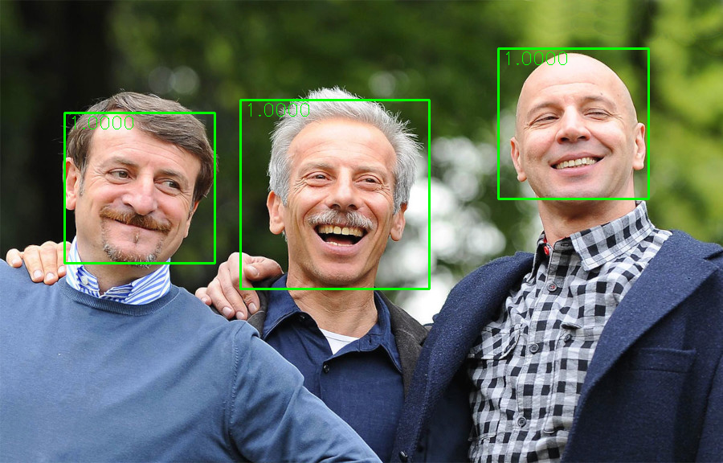

# Face detection
Realizzare un sistema di identificazione dei volti nelle immagini.

## Descrizione del progetto

Fornire una pipeline scikit-learn che prende un'immagine in ingresso e ritorna una lista con le coordinate dei bounding box dove sono presenti dei volti.
* Addestrare un ***Face classifier***
  *   distinguere se un'immagine contenga una faccia o no
  *   Come feature dell'immagine vengono usati gli istogrammi dei gradienti orientati (HOG)
  * Come modello viene scelto un classificatore SVM lineare, perché le specifiche del progetto richiedono che il modello usi poche risorse di calcolo
* Tecnica della ***sliding window***
  * si fa scorrere una piccola finestra lungo l'immagine (in altezza e in larghezza), e si classifica ogni singola istanza
  * si ottengono i bounding box di tutte le finestre classificate come facce
* Non-maximum suppression
  *   algoritmo per eliminare i bounding box ridondanti, ottenendo il risultato finale
 

  
